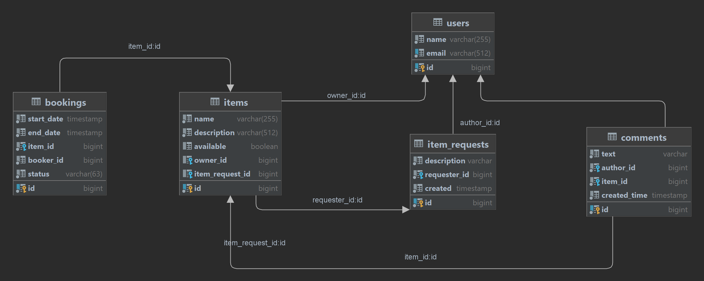

# java-shareit

<h1>ShareIt</h1>

Бэкэнд приложения для шеринга вещей.

<h3>REST-сервис с использованием:</h3>
<ul>
  <li>JavaCore</li>
  <li>Git</li>
  <li>Spring Boot</li>
  <li>Hibernate</li>
  <li>PostgreSQL</li>
  <li>Docker</li>
</ul>

